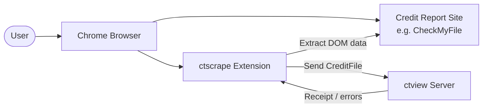
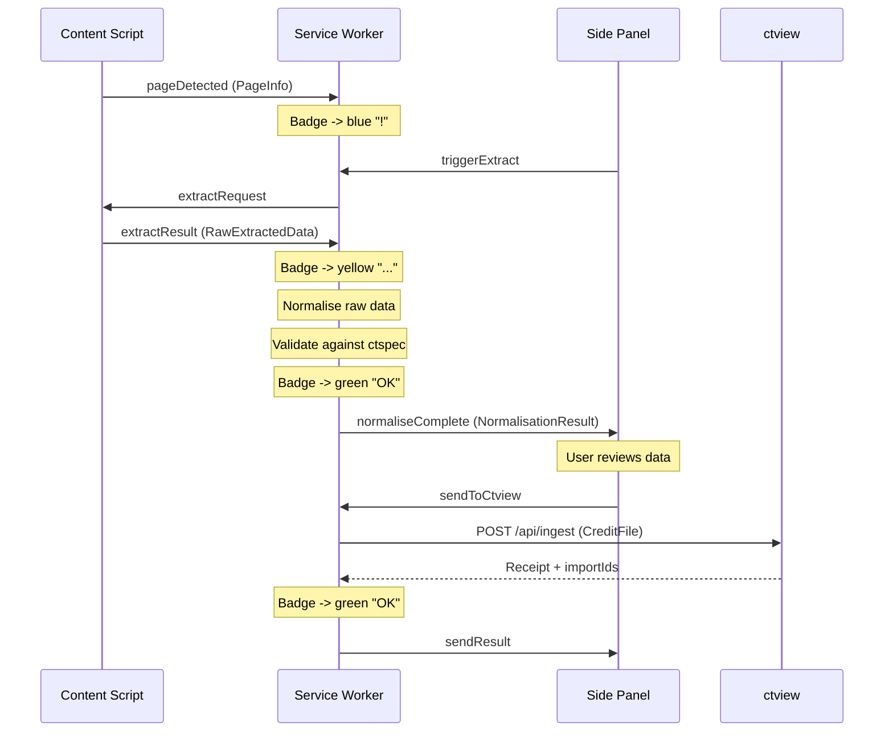

# Architecture

## System Context



The user navigates to a supported credit report site in Chrome. The ctscrape extension detects the report page, extracts structured data from the DOM, normalises it to the ctspec CreditTimeline schema, and sends it to the user's self-hosted ctview instance.

## Data Flow



### Pipeline Stages

1. **Detection** -- Content script loads on matching URLs and calls `adapter.detect(document)` to check if the page is a scrapeable report.
2. **Page Info** -- `adapter.getPageInfo(document)` extracts basic info (subject name, report date, providers) for display before full extraction.
3. **Extraction** -- On user request, `adapter.extract(document)` performs full DOM extraction, producing `RawExtractedData` with provenance metadata and raw field values.
4. **Normalisation** -- The service worker runs the normalisation engine, which processes raw sections through per-domain stages (subject, addresses, tradelines, searches, credit scores, etc.) to produce a `CreditFile`.
5. **Validation** -- Schema validation and referential integrity checks run against the assembled `CreditFile`. Errors block sending; warnings are shown but do not block.
6. **Send** -- The `CreditFile` is sent to ctview via the `@ctview/sdk` client. On success, a receipt ID is returned and the history entry is updated.
7. **Retry** -- Failed sends that are retryable (network errors, rate limits, server errors) are added to a persistent retry queue. An alarm fires every minute to process the queue with exponential backoff.

## Extension Contexts

| Context | Module | Responsibilities |
|---------|--------|-----------------|
| Content Script | `src/entrypoints/content.ts` | Page detection, DOM extraction, HTML capture and hashing. Runs in the page's origin. No normalisation or API calls. |
| Service Worker | `src/entrypoints/background.ts` | Orchestration hub. Manages extraction jobs (per-tab state machine), runs normalisation pipeline, validates output, sends to ctview, manages retry queue, updates badge. |
| Side Panel | `src/entrypoints/sidepanel/` | Primary UI. Connection settings, extraction trigger, data review with entity summaries, send confirmation, scrape history, settings. |
| Popup | `src/entrypoints/popup/` | Quick actions. Lightweight entry point for common operations. |

## Adapter Pattern

Each target credit report site gets its own adapter in `src/adapters/{site-name}/`. Adapters implement the `SiteAdapter` interface:

```typescript
interface SiteAdapter {
  readonly id: string;              // e.g. "checkmyfile"
  readonly name: string;            // e.g. "CheckMyFile"
  readonly version: string;         // semver, included in provenance
  readonly matchPatterns: string[];  // Chrome extension match patterns

  detect(document: Document): boolean;
  getPageInfo(document: Document): PageInfo;
  extract(document: Document): Promise<RawExtractedData>;
  getSupportedSections(): DataDomain[];
}
```

Adapters are registered via `registerAdapter()` in `src/adapters/registry.ts`. The content script imports the adapter module (which triggers registration) and the registry matches URLs to adapters.

### Adapter Internal Structure (CheckMyFile Example)

```
src/adapters/checkmyfile/
  index.ts               # Adapter definition + registration
  detector.ts            # detect() and getPageInfo() implementations
  extractor.ts           # Full extraction orchestration
  section-classifier.ts  # Classify DOM sections by report domain
  parsers.ts             # Date, currency, and text parsers
  constants.ts           # CSS selectors, CRA names, field mappings
  sections/              # Per-section extractors
    accounts.ts          # Tradeline/account extraction
    addresses.ts         # Address extraction
    aliases.ts           # Name/alias extraction
    associations.ts      # Financial associate extraction
    scores.ts            # Credit score extraction
    searches.ts          # Search/enquiry extraction
```

See [CONTRIBUTING.md](../CONTRIBUTING.md) for a step-by-step guide to adding a new adapter.

## Normalisation Pipeline

The normalisation engine (`src/normalizer/engine.ts`) takes `RawExtractedData` and produces a validated `CreditFile`. Processing runs through these stages in order:

| Stage | Module | Description |
|-------|--------|-------------|
| Import Batches | `stages/import-batches.ts` | Create import batch records with provenance metadata |
| Subject | `stages/subject.ts` | Normalise person names from personal_info sections |
| Addresses | `stages/addresses.ts` | Parse and normalise address records |
| Electoral Roll | `stages/electoral-roll.ts` | Normalise electoral roll entries |
| Organisations | `stages/organisations.ts` | Create organisation records for creditors |
| Tradelines | `stages/tradelines.ts` | Build tradeline records with payment history |
| Searches | `stages/searches.ts` | Normalise credit search/enquiry records |
| Credit Scores | `stages/credit-scores.ts` | Normalise credit score records per CRA |
| Financial Associates | `stages/financial-associates.ts` | Normalise financial association records |
| Assemble | `stages/assemble.ts` | Assemble all normalised entities into a CreditFile payload |
| Schema Validation | `validation/schema-validator.ts` | Validate against ctspec JSON schema |
| Referential Integrity | `validation/referential-integrity.ts` | Check cross-entity references are valid |

### Data Conventions

- **Monetary values**: Integer minor units (pence). `"£1,234.56"` becomes `123456`.
- **Dates**: ISO 8601 (`YYYY-MM-DD`). Periods as `YYYY-MM`.
- **Enums**: Must match ctspec definitions exactly.
- **`acquisition_method`**: Always `"html_scrape"` for extension-produced data.
- **`source_wrapper`**: The site name (e.g. `"CheckMyFile"`).

## Messaging Protocol

All inter-context communication uses `@webext-core/messaging` with a typed `ProtocolMap`.

| Message | Sender | Receiver | Purpose |
|---------|--------|----------|---------|
| `pageDetected` | Content Script | Service Worker | Report page found (includes PageInfo) |
| `pageLeft` | Content Script | Service Worker | Navigated away from report page |
| `extractRequest` | Service Worker | Content Script | Request full DOM extraction |
| `extractResult` | Content Script | Service Worker | Return extracted RawExtractedData |
| `extractError` | Content Script | Service Worker | Report extraction failure |
| `normaliseComplete` | Service Worker | Side Panel | Normalisation finished (includes NormalisationResult) |
| `sendToCtview` | Side Panel | Service Worker | User approved send (returns SendResult) |
| `sendResult` | Service Worker | Popup | Broadcast send outcome |
| `testConnection` | Side Panel | Service Worker | Test ctview server connection |
| `manualRetry` | Side Panel | Service Worker | Retry a failed send from history |
| `triggerExtract` | Side Panel/Popup | Service Worker | Request extraction via background |
| `getStatus` | Side Panel/Popup | Service Worker | Get current ExtensionStatus |

## Storage Strategy

Per AD-008, storage is partitioned across Chrome's three storage areas:

| Area | Scope | Contents |
|------|-------|----------|
| `sync` | Synced across devices | `connectionSettings` (server URL, API key), `userPreferences` (default subject ID, auto-extract, theme) |
| `local` | This device only | `scrapeHistory` (up to 50 entries), `retryQueue` (failed sends awaiting retry) |
| `session` | Cleared on browser close | `currentExtraction` (temporary extraction state) |

All storage access uses WXT's typed `storage.defineItem()` wrappers for type safety.

## Validation Pipeline

Data is validated at two points:

1. **Client-side (before send)**: The normalisation engine runs schema validation and referential integrity checks. Errors block sending; warnings are displayed but do not block.
2. **Server-side (on ingest)**: ctview performs its own validation. 422 responses are classified as non-retryable validation failures.

## Error Handling and Retry

### Error Classification

Send errors are classified by the `classifySendError()` function:

| Error Code | HTTP Status | Retryable | Action |
|------------|-------------|-----------|--------|
| `VALIDATION_FAILED` | 422 | No | Show error details to user |
| `DUPLICATE_IMPORT` | -- | No | Mark as duplicate |
| `UNAUTHORIZED` | 401 | No | Prompt to check API key |
| `RATE_LIMITED` | 429 | Yes | Queue for retry |
| `NOT_READY` | 503 | Yes | Queue for retry |
| Server errors | 5xx | Yes | Queue for retry |
| `NETWORK_ERROR` | -- | Yes | Queue for retry |

### Retry Queue

- Persistent queue in `local` storage survives service worker restarts.
- Chrome alarm fires every 1 minute to process the queue.
- Exponential backoff: 30s base delay, doubling per retry, capped at 30 minutes.
- 20% random jitter to prevent thundering herd.
- Maximum 5 retry attempts before permanent failure.
- Manual retry resets the timer and triggers immediate processing.

### Extraction State Machine

The orchestrator tracks per-tab extraction jobs through a state machine:

```
idle -> detected -> extracting -> normalising -> ready -> sending -> complete
                        |              |                     |
                        v              v                     v
                      error          error                 error
```

Jobs are in-memory in the service worker. If the service worker restarts, the content script re-detects on next interaction.

## ADR Summary

| ADR | Decision | Rationale |
|-----|----------|-----------|
| AD-001 | WXT + Svelte 5 | WXT simplifies MV3 development; Svelte 5 runes provide reactive UI with minimal boilerplate |
| AD-002 | Manifest V3, Chrome-first | MV3 is required for new Web Store submissions; Chrome has dominant market share |
| AD-003 | Adapter pattern for multi-site | Decouples site-specific scraping from core extension logic; new sites need only a new adapter |
| AD-004 | ctspec as canonical output | Shared schema across ctscrape and ctview ensures interoperability and validation |
| AD-005 | @ctview/sdk for API | Type-safe client library handles auth, serialisation, and error classification |
| AD-006 | Content script extraction, SW orchestration | Content scripts have DOM access; service workers handle compute and network for MV3 compliance |
| AD-007 | Shadow DOM for injected UI | Isolates extension UI styles from host page styles |
| AD-008 | Local storage strategy (sync/local/session) | Settings sync across devices; data stays local; temp state is ephemeral |
| AD-009 | Provenance and artifact tracking | HTML hashing, timestamps, and adapter versions enable audit trail and reproducibility |
| AD-010 | Validation before send | Client-side validation catches errors before network round-trip; server validates independently |
